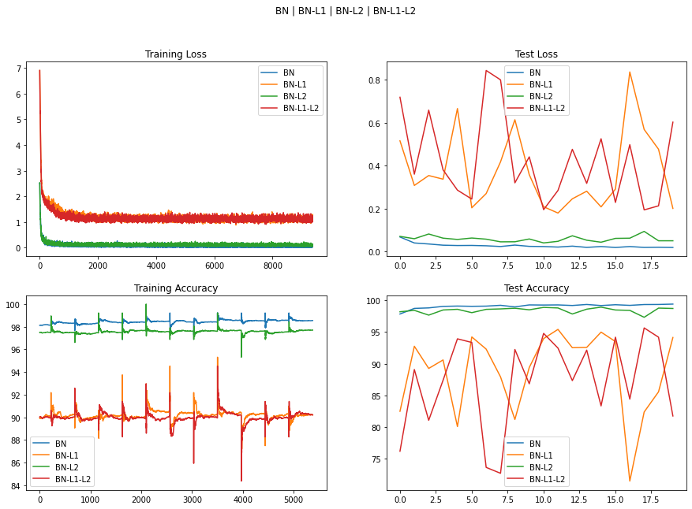
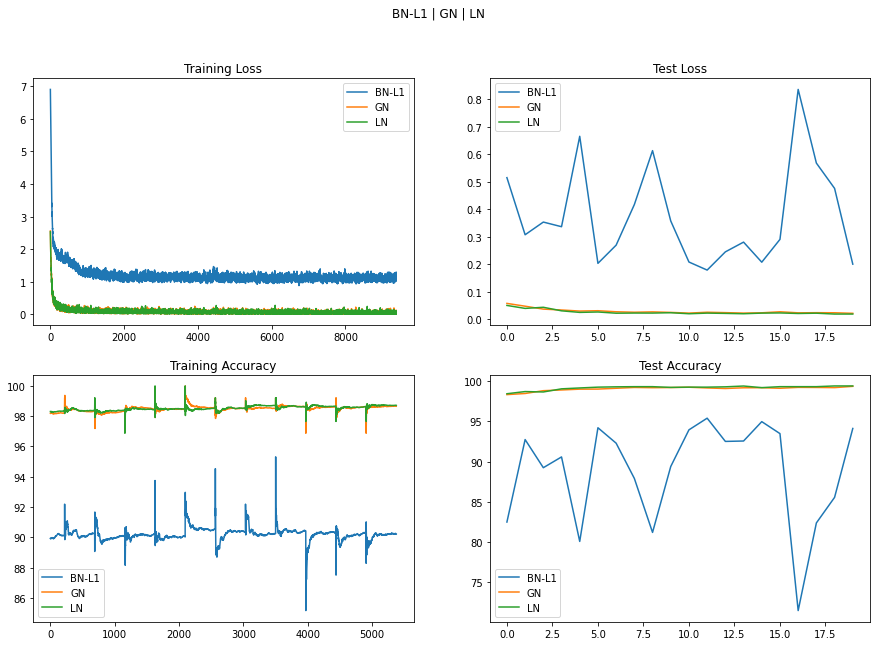

# Normalization and Regularization Experiments

## Normalization Methods

Three main methods are currently used: Batch Normalization, Group Normalization, and Layer Normalization

### Batch Normalization

### Group Normalization

### Layer Normalization

## Training Experiments

### Setup

BatchNorm, GroupNorm, and LayerNorm are supported by the model - usage of each is through passing params for each.

For BatchNorm and LayerNorm, default Pytorch values are used.
For GroupNorm, group size of `2` is used.

For L1 regularization, lambda of `0.01` is used.
For L2 regularization, same value, `0.01` of weight decay is used.

LR - `0.0` is kept the same throughout.
Model is trained for `20` epochs, `SGD` optimizer.

### Results

### Inference

Full training logs + misclassified samples & graphs in the `Normalization.ipynb` notebook