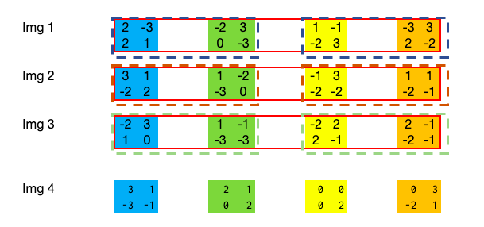
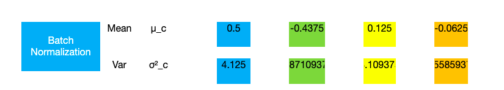
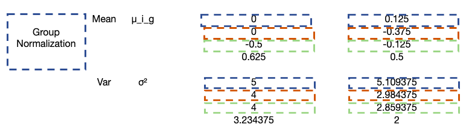
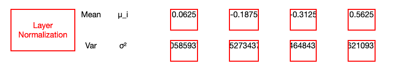

# Normalization Experiments

## Methods

Three main methods are currently used: Batch Normalization, Group Normalization, and Layer Normalization

### Batch Normalization

### Group Normalization

### Layer Normalization

## Training Experiments

Full training logs + misclassified samples & graphs in the `Normalization.ipynb` notebook