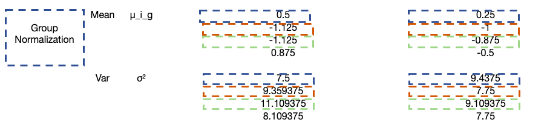
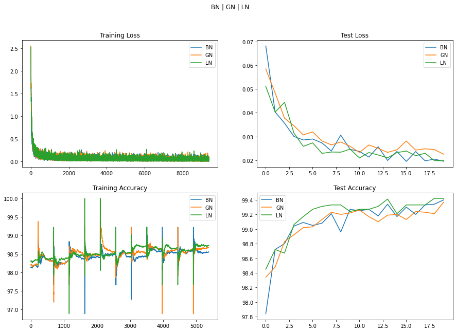

# Normalization and Regularization Experiments

## Normalization Methods

Three main methods are currently used: Batch Normalization, Group Normalization, and Layer Normalization

### Batch Normalization
For each channel, we calculate a mean & std. dev. across all images.
So if we have 32 channels, we get 32 diff values for batch norm.

Given a batch of (N,C,H,W), mean and std. dev. gets calculated along the (N,H,W) axis.

This gets calculated every batch - for all images in the batch. So this might not perform as well if our batch size is too low. Values for 1 image in the batch is dependent on all the other images in that batch.

### Group Normalization

Given a batch of (N,C,H,W), mean and std. dev. gets calculated along the (H,W) axis — along a group of channels. We need to define a group size here.

### Layer Normalization

Given a batch of (N,C,H,W), mean and std. dev. gets calculated along the (C,H,W) axis.

Values for 1 image in the batch is not dependent on other images.

## Training Experiments

### Setup

BatchNorm, GroupNorm, and LayerNorm are supported by the model - usage of each is through passing params for each.

For BatchNorm and LayerNorm, default Pytorch values are used.
For GroupNorm, group size of `2` is used.

For L1 regularization, lambda of `0.01` is used.
For L2 regularization, same value, `0.01` of weight decay is used.

LR - `0.0` is kept the same throughout.
Model is trained for `20` epochs, `SGD` optimizer.

### Results

### Inference

1. Adding L1 as regularization makes the training very erratic on the test set. Comparitively, L2 regularization training is more stable.
2. Result on test set is almost comparable between BatchNorm, LayerNorm, and GroupNorm - though LayerNorm performs slightly better, but with way more params.
3. LayerNorm with L1 reaches 99.5, but results are not as stable.
4. BatchNorm with L2 seems to be the best approach to take based on current results.

Full training logs + misclassified samples & graphs in the `Normalization.ipynb` notebook